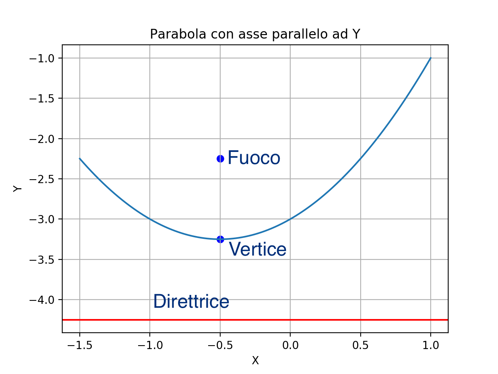

# Ripasso sulle coniche

##### Filippo Tonietto & Alberto Cereser

Le coniche sono quattro curve determinate dall'intersezione di un piano con un un cono. In questo modulo verranno presentate parabola, ellisse, circonferenza ed iperbole sia da un punto di vista teorico che tramite esercizi e grafici.

### Risoluzione di un'equazione di secondo grado

Forma canonica dell'equazione di secondo grado:

  

*Perchè ci serve?* Il *discriminante* di un'equazione di secondo grado (che si indica con la lettera greca maiuscola *delta*), ci permette di distinguere, a seconda del valore che assume, se l'equazione di secondo grado data ha o meno soluzioni e, in caso affermativo, di riconoscere se esse sono distinte o coincidenti. 

  

Una volta calcolato il valore del discriminante, dobbiamo distinguere tre casi:
  1. ;
    In questo caso esiste la radice quadrata di , dunque l'equazione di secondo grado ha *due soluzioni distinte*:
    

      
  

  
  2. ;
    In questo caso, la radice quadrata del discriminante è uguale a zero, e l'equazione di secondo grado avrà *due soluzioni coincidenti*:
    

      ;
  

  
  3. ;
    In questo caso l'equazione è *impossibile*, perché qualsiasi numero reale elevato al quadrato risulterà maggiore o uguale a zero e non potrà essere minore del secondo membro, che è negativo.

Quando più avanti parleremo di intersezioni o di sistemi di secondo grado *impossibili* o *con soluzioni coincidenti*, sarà attraverso il calcolo del *delta* che potremmo verificare se e come una retta, ad esempio, si interseca con una parabola. 

## Parabola

### Introduzione

La parabola è il luogo geometrico dei punti equidistanti da un punto fisso, detto _fuoco_, e da una retta data, detta _direttrice_.

L'equazione di una parabola con l'asse parallelo all'asse delle Y è:

  

L'equazione di una parabola con l'asse parallelo all'asse delle X è:

  

Vuoi disegnare una parabola con asse paralello all'asse Y o all'asse X? Prova [questo](https://github.com/albusdemens/Ripasso_coniche/blob/master/Parabola.py) script in Python!

Con [quest'altro script](https://github.com/albusdemens/Ripasso_coniche/blob/master/Intersezione_parabola_retta.py) puoi disegnare l'intersezione di una parabola con un segmento. 

### Intersezioni retta-parabola

Data una parabola ed una retta con equazione *y = mx+q*, per trovare gli eventuali punti di intersezione si segue il seguente procedimento:
1. Mettere a sistema l'equazione della retta e l'equazione della parabola;
2. Risolvere il sistema di secondo grado così formato e ricavare gli eventuali valori delle incognite x ed y:

    A. Se il sistema risulta *impossibile*, quindi non è possibile ricavare né il valore di x né quello di y, allora vuol dire         che la retta e la parabola non hanno punti in comune: si dice che la retta è *esterna* alla parabola;

    B. Se il sistema ha *due soluzioni coincidenti*, cioè *una soluzione doppia*, la retta e la parabola sono *tangenti*;

    C. Se il sistema ha *due soluzioni distinte*, la retta e la parabola sono *secanti*;

3. Eventualmente, rappresentare graficamente la soluzione.    

### Determinazione della retta tangente

## Ellisse

## Circonferenza

## Iperbole
